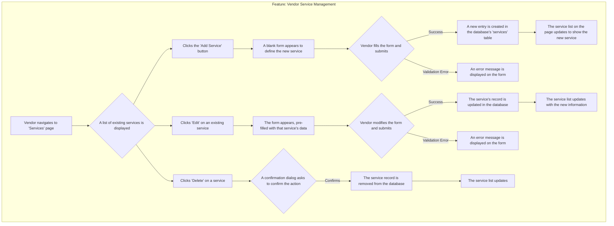
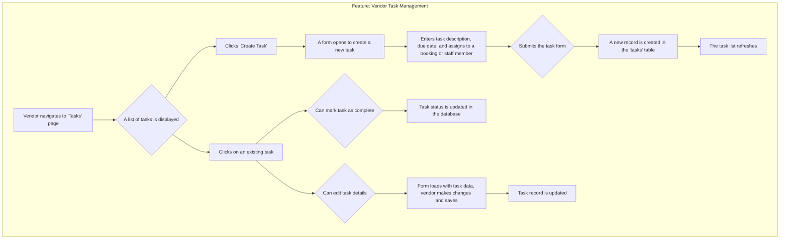
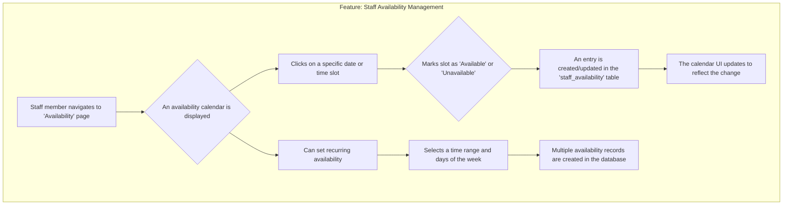
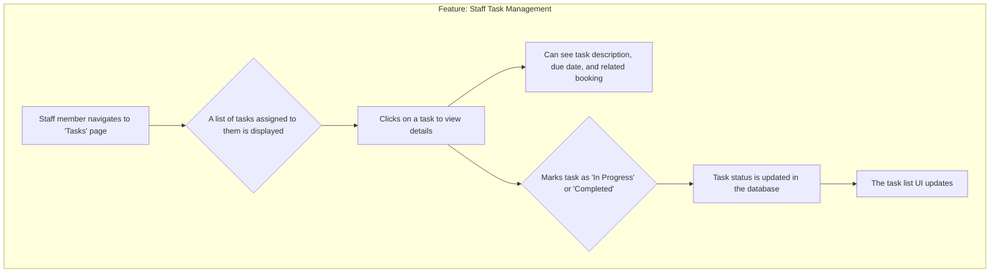
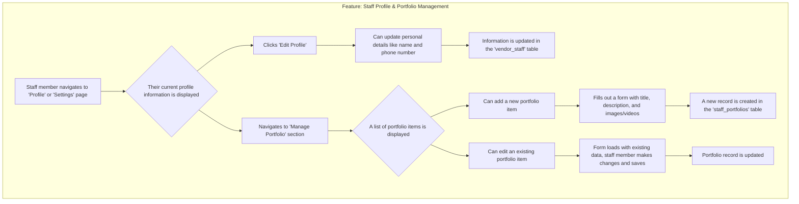

# Application Feature Deep Dives

This document provides detailed, step-by-step internal flows for each major feature of the application for both Vendors and Staff.

---

## 1. Vendor Service Management

This flow details how a vendor adds, edits, and removes the services their business offers.



---

## 2. Vendor Booking Management

This flow outlines how a vendor manages incoming bookings, assigns staff, and updates booking statuses.

```mermaid
graph TD
    subgraph "Feature: Vendor Booking Management"
        A[Vendor navigates to 'Bookings' page] --> B{A list of all bookings is displayed};
        B --> C[Clicks on a specific booking];
        C --> D[A detailed view of the booking opens];
        D --> E[Can view customer details, service requested, date/time];
        D --> F{Assign staff to booking};
        F --> G[Selects a staff member from a dropdown];
        G --> H[Booking record is updated with the assigned staff_id];
        D --> I{Update booking status};
        I --> J[Selects new status (e.g., 'Confirmed', 'Completed', 'Cancelled')];
        J --> K[Booking record status is updated in the database];
        D --> L[Add notes to the booking];
        L --> M[Enters text into a notes field and saves];
        M --> N[Note is added to the booking record];
    end
```

---

## 3. Vendor Task Management

This flow shows how a vendor creates tasks and assigns them to staff or bookings.



---

## 4. Staff Availability Management

This flow details how staff members manage their work schedules.



---

## 5. Staff Task Management

This flow shows how a staff member views and updates the tasks assigned to them.



---

## 6. Staff Profile & Portfolio Management

This flow outlines how a staff member can manage their personal information and professional portfolio.


