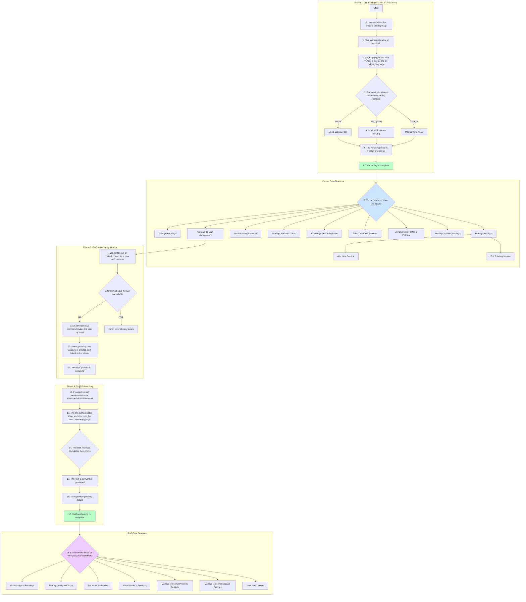

# Full Application Feature Flow

This diagram provides a comprehensive map of the entire application's features, detailing the journey and capabilities for both vendors and their staff.

```mermaid
graph TD
    %% --- Phase 1: Onboarding (Vendor) ---
    subgraph "Phase 1: Vendor Registration & Onboarding"
        A[Start] --> B(A new user visits the website and signs up);
        B --> C[1. The user registers for an account];
        C --> D[2. After logging in, the new vendor is directed to an onboarding page];
        D --> E{3. The vendor is offered several onboarding methods};
        E -- AI Call --> F[Voice assistant call];
        E -- File Upload --> G[Automated document parsing];
        E -- Manual --> H[Manual form filling];
        F & G & H --> I(4. The vendor's profile is created and stored);
        I --> J[5. Onboarding is complete];
    end

    %% --- Phase 2: Vendor Core Application Features ---
    subgraph "Vendor Core Features"
        J --> V_Dashboard{6. Vendor lands on Main Dashboard};
        V_Dashboard --> V_Bookings[Manage Bookings];
        V_Dashboard --> V_Services[Manage Services];
        V_Services --> V_AddService[Add New Service];
        V_Services --> V_EditService[Edit Existing Service];
        V_Dashboard --> V_Calendar[View Booking Calendar];
        V_Dashboard --> V_Tasks[Manage Business Tasks];
        V_Dashboard --> V_Payments[View Payments & Revenue];
        V_Dashboard --> V_Reviews[Read Customer Reviews];
        V_Dashboard --> V_Profile[Edit Business Profile & Policies];
        V_Dashboard --> V_Settings[Manage Account Settings];
        V_Dashboard --> V_Staff[Navigate to Staff Management];
    end

    %% --- Phase 3: Staff Invitation ---
    subgraph "Phase 3: Staff Invitation by Vendor"
        V_Staff --> L[7. Vendor fills out an invitation form for a new staff member];
        L --> M{8. System checks if email is available};
        M -- No --> N[9. An administrative command invites the user by email];
        N --> O[10. A new, pending user account is created and linked to the vendor];
        O --> Q(11. Invitation process is complete);
        M -- Yes --> R[Error: User already exists];
    end

    %% --- Phase 4: Staff Onboarding ---
    subgraph "Phase 4: Staff Onboarding"
        Q --> S[12. Prospective staff member clicks the invitation link in their email];
        S --> T[13. The link authenticates them and directs to the staff onboarding page];
        T --> U{14. The staff member completes their profile};
        U --> V[15. They set a permanent password];
        V --> W[16. They provide portfolio details];
        W --> X(17. Staff onboarding is complete);
    end

    %% --- Phase 5: Staff Core Application Features ---
    subgraph "Staff Core Features"
        X --> S_Dashboard{18. Staff member lands on their personal dashboard};
        S_Dashboard --> S_Bookings[View Assigned Bookings];
        S_Dashboard --> S_Tasks[Manage Assigned Tasks];
        S_Dashboard --> S_Availability[Set Work Availability];
        S_Dashboard --> S_Services[View Vendor's Services];
        S_Dashboard --> S_Profile[Manage Personal Profile & Portfolio];
        S_Dashboard --> S_Settings[Manage Personal Account Settings];
        S_Dashboard --> S_Notifications[View Notifications];
    end

    %% Styles
    style J fill:#baffc9
    style X fill:#baffc9
    style V_Dashboard fill:#cde4ff
    style S_Dashboard fill:#eecbff
```
