# Detailed Vendor & Staff Management Flow

This document outlines the complete, verified process flow for vendor onboarding, staff invitation, and staff onboarding, based on a detailed analysis of the codebase.

```mermaid
graph TD
    subgraph "Phase 1: Vendor Registration & Onboarding"
        A[Start] --> B(A new user visits the website and navigates to the sign-up page);
        B --> C[1. The user registers for an account];
        C --> D[2. After logging in, the new vendor is directed to an onboarding page];
        D --> E{3. The vendor is offered several onboarding methods};
        E -- AI Call --> F[A voice assistant calls the vendor to gather profile information];
        E -- File Upload --> G[The vendor uploads a document to be automatically parsed];
        E -- Manual --> H[The vendor chooses to fill out a standard profile form manually];
        F --> I(4. The vendor's profile is created and stored);
        G --> I;
        H --> I;
        I --> J[5. Onboarding is complete, and the vendor is taken to their main dashboard];
    end

    subgraph "Phase 2: Staff Invitation by Vendor"
        J --> K{6. From the dashboard, the vendor navigates to the staff management section};
        K --> L[7. The vendor fills out an invitation form with the new staff member's details];
        L --> M{8. The system checks if the staff member's email is already in use};
        M -- No --> N[9. An administrative command is triggered to invite the user by email];
        N --> O[10. A new user account is created in the system, and an invitation email with a unique link is sent];
        O --> P[11. The new staff account is immediately associated with the vendor's business];
        P --> Q(12. The invitation process is complete from the vendor's side);
        M -- Yes, already on team --> R[Error: A staff member with that email already exists];
    end

    subgraph "Phase 3: Staff Onboarding"
        Q --> S[13. The prospective staff member receives the email and clicks the invitation link];
        S --> T[14. The link authenticates the user and directs them to a dedicated staff onboarding page];
        T --> U{15. The staff member is prompted to complete their profile};
        U --> V[16. They set a permanent password for their account];
        V --> W[17. They provide portfolio details, which are saved to their new profile];
        W --> X(18. The staff member's onboarding is now complete);
    end

    subgraph "Phase 4: Staff Dashboard Access"
        X --> Y[19. The staff member is automatically redirected to their own dashboard];
        Y --> Z[20. The staff member can now access all features specific to their role, such as managing availability, viewing tasks, and checking bookings];
    end

    style C fill:#cde4ff
    style E fill:#cde4ff
    style L fill:#cde4ff
    style N fill:#daffd1
    style P fill:#daffd1
    style S fill:#fff4c1
    style U fill:#fff4c1
    style Y fill:#eecbff
```

